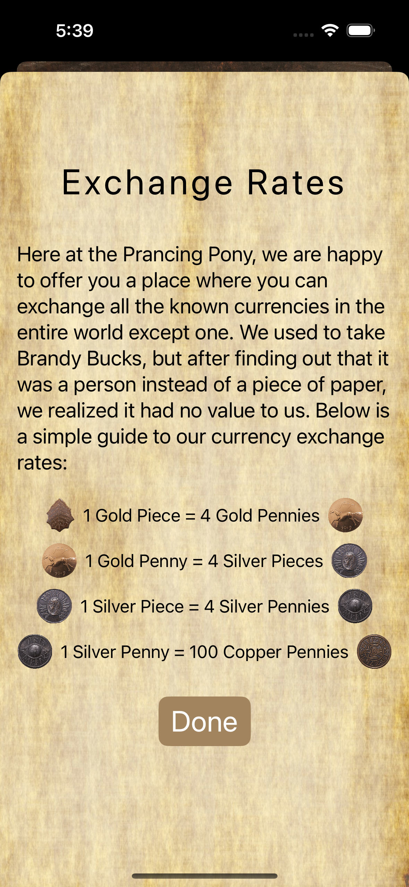
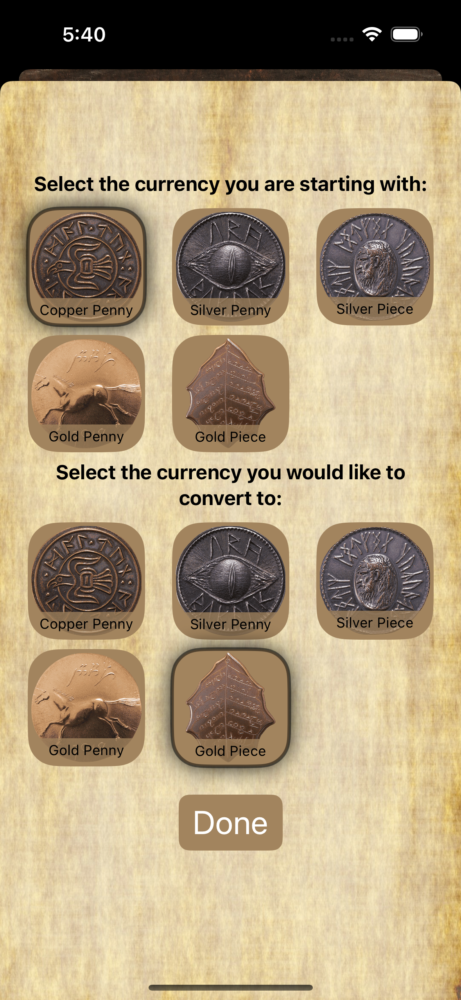

# SwiftUI_CurrencyConvertor

    &nbsp;&nbsp;&nbsp;
    &nbsp;&nbsp;&nbsp;
    
  

  
  ## Overview
This SwiftUI project is a Lord of the Rings themed currency converter application.

Based on the Udemy course [iOS 18, SwiftUI 6, & Swift 6: Build iOS Apps From Scratch](https://www.udemy.com/course/ios-15-app-development-with-swiftui-3-and-swift-5/).
